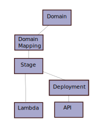

# TL;DR

How we deploy an [API gateway](https://aws.amazon.com/api-gateway/).

## Introduction

An [API gateway](https://aws.amazon.com/api-gateway/) on AWS provides a scalable and serverless platform for deploying an HTTP API backed by a [lambda function](https://aws.amazon.com/lambda/), served to clients via a [cloudfront cdn](https://aws.amazon.com/cloudfront/), and metered per client request.  This architecture trades the traditional costs and complexity of maintaining a cluster of servers to host an API for a new set of challenges.  The people (developers, QA, operators, managers) running an API gateway project must become familiar with the technology stack, and adopt tools for integrating the gateway platform into a development and deployment process.  We have begun to adopt a simple process using our own [little tools](https://github.com/frickjack/misc-stuff/).

## API Overview

An API gateway deploys several AWS resources with the goal (usually) of making a [lambda function](https://aws.amazon.com/lambda) executable via an HTTP API by linking the lambda to an API definition with a gateway stage. Let's look at the infrastructure from the bottom up.

* First, we deploy a [lambda](https://aws.amazon.com/lambda/) function that implements the API gateway [proxy integration](https://docs.aws.amazon.com/apigateway/latest/developerguide/api-gateway-create-api-as-simple-proxy-for-lambda.html) protocol.
* Next we write an [openapi](https://www.openapis.org/) description of our HTTP API with some [AWS extensions](https://docs.aws.amazon.com/apigateway/latest/developerguide/http-api-open-api.html) to describe how the API integrates with our lambda.
* We create an [ApiGateway RestAPI](https://docs.aws.amazon.com/apigateway/latest/developerguide/apigateway-rest-api.html) resource to hold our API definition, and an [API deployment](https://docs.aws.amazon.com/apigateway/latest/developerguide/how-to-deploy-api.html) - which is an immutable copy of the API definition that links to one or more API stages (described below).
* We now create beta and production [API stages](https://docs.aws.amazon.com/apigateway/latest/developerguide/set-up-stages.html) that each link to the deployment holding the API definition that we want to publish to the stage.  The stage configures a regional endpoint for accessing the API.
* Finally, we create a custom domain for our prod and beta API's, and a domain mapping that maps an API stage to a particular URL prefix under the domain (something like https://beta-my.domain/my-api1).  We can setup mappings to link stages for different API's to a common domain (https://beta-my.domain/my-api1, https://beta-my.domain/my-api2, ...).

## Development Process

The usual way of working with [cloudformation](https://aws.amazon.com/cloudformation/) is to define a template
for a particular kind of deployment that takes configuration parameters, then stamp out different stacks with the template.  Unfortunately API gateway does not lend itself to that pattern in a straight forward way, because common gateway tasks require adding new resources to the template rather than simply changing parameters on existing resources.  

Systems like the following take different approaches to address this problem.

* the [serverless application model (SAM)](https://aws.amazon.com/serverless/sam/) extends cloudformation with tools and macros
* the [serverless framework](https://www.serverless.com/) provides tools that deploy serverless applications across different clouds from its own yaml configuration files
* the [aws cloud development kit](https://aws.amazon.com/cdk/) provides software libraries for expressing cloudformation templates programatically

We implement our own [little tools](https://github.com/frickjack/misc-stuff/tree/master/AWS/doc) that extend cloudformation templates with expressions (from the [nunjucks](https://mozilla.github.io/nunjucks/) template library) that can dynamically add resources to a stack based on variable values.
The `little stack` tools consume a json stack definition
with three main parts:
* a reference to a clouformation template
* values for the cf parameters defined in the template
* values for the nunjucks variables leveraged in the template

If an optional `openapi.yaml` file is present, then its contents are also exposed as a nunjucks variable.  

## OIDC Client Example 

Let's look in a little more detail at how we use the `little stack` and `little lambda` helpers to deploy [one stack](https://github.com/frickjack/misc-stuff/tree/master/AWS/db/cloudformation/frickjack/cell0/api/api.frickjack.com/authclient) that uses [this](https://github.com/frickjack/misc-stuff/tree/master/AWS/lib/cloudformation/cellSetup/api/authclient) nunjucks-extended cloudformation template.
The OIDC API fits into a larger appliction infrastructure with these components:

* a cognito identity provider - `auth.domain`
* a cloudfront distribution that serves static files for webapps from an S3 bucket - `apps.domain`
* API's implemented as lambda functions behind an API gateway - `api.domain`

The OIDC client API is one of the API's under `api.domain`.

### Deploying Code

The `authcilent/code/` folder alongside the `authclient/apiGateway.json` cloudformation template holds the [lambda deployment package](https://docs.aws.amazon.com/lambda/latest/dg/nodejs-create-deployment-pkg.html) that integrates the `@littleware/little-authn` node module with AWS lambda and API gateway.  The `beta` API gateway stage (described below) executes the `$LATEST` lambda code, and the `prod` stage executes the lambda version referenced by the `gateway_prod` lambda alias.

The `LambdaBucket` and `LambdaKey` template parameters
specify the location of the code package to deploy to the lambda function.  We do something like this to deploy a code change in the beta stage:
 
* update `code/`
* upload the new code package with `little lambda upload`
* update the default values for the `LambdaBucket` and `LambdaKey` parameters in the `apiGateway.json` template definition to point at the new code package
* update the cloudformation stacks that use the template to deploy the new code: `little stack update ./stackParams.json`
* the `little stack events ./stackParams.json` helper shows the latest cloudformation events to verify that the stack updated successfully

### Configuration

The `authclient/` cloudformation template expects the lambda function's configuration to be saved as json in an [SSM parameter](https://docs.aws.amazon.com/systems-manager/latest/userguide/systems-manager-parameter-store.html).
The `little ssm` helper simplifies saving a new parameter, and the [little-authn documentation](https://github.com/frickjack/little-authn/blob/master/Notes/howto/devTest.md#configuration) has details about the expected configuration.

The lambda receives its configuration as an environment variable.  The adapter code in `code/index.js` customizes the configuration depending on which stage is executing.

### Publish code to prod

Publishing a new lambda version is one of the operations that relies upon our cloudformation template extensions to simplify the process of adding new resources (lambda versions) to a stack.

* add a new version to the `.Littleware.Variables.lambdaVersions` list in the `stackParams.json` file that `little stack` consumes - this will deploy a new lambda version with the currently deployed lambda code package
* point `.Littleware.Variables.prodLambdaVersion` at the new version to update the `gateway_prod` lambda alias
* `little stack update ./stackParams.json`

### Deploy a new version of the API

Updating the API definition is the other operation that relies upon our `little stack` cloudformation template extensions.

* edit the `openapi.yaml` to make the api changes
* run cloudformation to update the api definition: `little stack update ./stackParams.json`
* add a new deployment to the `.Littleware.Variables.gatewayDeployments` array in `stackParams.json`, and point the beta domain stage at it by setting the `.Littleware.Variables.betaDeployment` (the `prodDeployment` variable updates the prod stage)
* run cloudformation to update the beta stage: `little stack update ./stackParams.json`

### Tests

The `authclient/smokeTest.sh` script runs an interactive test from the underlying `@littleware/little-authn` node module.  The test walks the caller through a simple OIDC flow to verify the basic functionality of an API domain.

## Summary

Transitioning to an API gateway and lambda based technology stack requires the people that run a project to learn new concepts, and adopt new tools for development and deployment processes.
We have begun to adopt a simple process using our own [little tools](https://github.com/frickjack/misc-stuff/).
